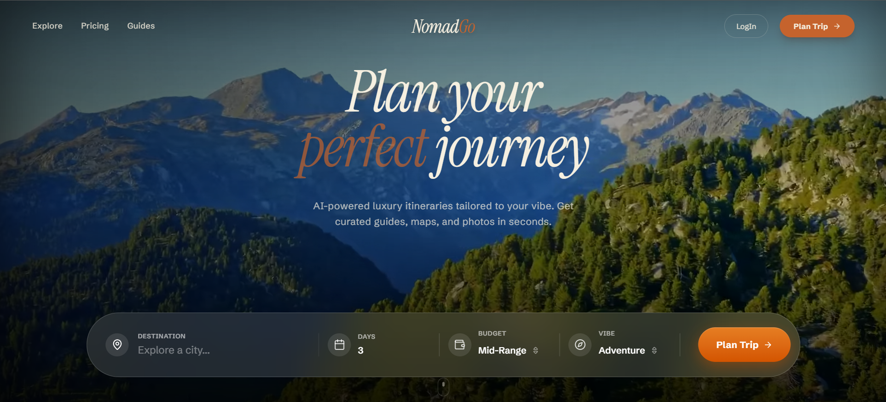

# NomadGo: AI-Powered Editorial Travel Planning

NomadGo is a premium, full-stack travel orchestration platform that transforms simple destination ideas into high-fidelity, print-ready editorial itineraries. Designed for the modern traveler, it combines state-of-the-art AI generation with a resilient background processing architecture to deliver cinematic travel experiences.

---

## 🌟 Overview

NomadGo isn't just a trip planner; it's an automated travel concierge. It solves the "blank page" problem of trip planning by using Large Language Models (LLMs) to craft geographically sensible, vibe-aligned, and budget-conscious journeys. Every itinerary is enriched with high-resolution photography, precise mapping, and insider insights, culminatimg in a professional PDF export.

## 🏗️ Technical Architecture

The platform is built with a focus on **reliability** and **scalability**, utilizing a distributed architecture to handle compute-intensive tasks without blocking the user interface.

### 1. AI Orchestration Engine
- **Core**: Powered by **Gemini 1.5 Flash** via the **Vercel AI SDK**.
- **Grounding**: Uses internal destination metadata and real-world coordinates to ensure accuracy.
- **Structured Data**: Implements strict Zod schemas to ensure deterministic output for complex UI components.

### 2. Media Enrichment Pipeline (The "Aesthetic" Layer)
To avoid the generic look of AI-generated content, NomadGo features a custom media pipeline:
- **Multi-Source Discovery**: Intelligently queries **Unsplash**, **Pexels**, and **Wikimedia** based on activity category (Landmarks vs. Dining).
- **Asset Persistence**: All resolved images are processed and cached to **Cloudflare R2** (S3-Compatible) to prevent link rot and ensure high-performance delivery.
- **Optimization**: Automated image hashing and metadata extraction for consistent aspect ratios and attribution.

### 3. Distributed Background Processing (BullMQ)
Heavy operations are offloaded to a resilient worker system:
- **Itinerary Generation**: Handled asynchronously to manage LLM latency and rate limits.
- **PDF Export**: A specialized worker uses **Puppeteer-Core** and **@sparticuz/chromium** to render pixel-perfect, editorial-grade PDFs in the background.
- **Resiliency**: Implements exponential backoff and job retries to handle transient API failures (e.g., Gemini rate limits).

### 4. Database & Auth
- **ORM**: **Prisma** with a PostgreSQL backbone.
- **Authentication**: **NextAuth.js** for secure, multi-provider access.
- **State Management**: Real-time progress tracking for background jobs via API polling.

---

## 📸 Screenshots

|  
---

## 📄 Sample Itinerary

Experience the editorial quality of our generated guides:
- **[Download Sample PDF Itinerary (Hampi 3-Day Guide)](https://pub-7ff19c3009334269bb2dae0371a0478b.r2.dev/exports/cmoz6tb6k00064ov8dze37um8-1778529219380.pdf)**

---

## 🛠️ Tech Stack

| Category | Technologies |
| :--- | :--- |
| **Frontend** | Next.js 16 (App Router), Tailwind CSS 4, Framer Motion, Radix UI |
| **Backend** | Node.js, BullMQ (Redis), TSX |
| **AI/ML** | Google Gemini API, Vercel AI SDK |
| **Storage** | Cloudflare R2 (S3), PostgreSQL (Neon/Supabase) |
| **Infrastructure**| Railway (Deployment), Upstash (Serverless Redis) |
| **PDF Engine** | Puppeteer, Headless Chromium |

---

## 🚀 Features

- **🎯 Vibe-Based Planning**: Generate trips based on "Luxury", "Backpacker", "Adventure", or "Cultural" vibes.
- **📸 High-Fidelity Imagery**: Automatic "smart-matching" of high-resolution travel photography.
- **📄 Editorial PDF Export**: Transform digital itineraries into beautiful, print-ready travel booklets.
- **💳 Credits System**: Integrated **Stripe** payments for premium itinerary generation.
- **🗺️ Interactive Maps**: Visualizing routes and stops with precise geolocation data.

---

## ⚙️ Environment Setup

To run NomadGo locally, clone the repository and configure the following:

```env
# Database & Redis
DATABASE_URL="your_postgresql_url"
REDIS_URL="your_redis_url"

# AI
GOOGLE_GENERATIVE_AI_API_KEY="your_gemini_key"

# Storage (Cloudflare R2)
R2_ACCESS_KEY_ID="your_key"
R2_SECRET_ACCESS_KEY="your_secret"
R2_BUCKET_NAME="nomadgo-assets"
R2_PUBLIC_URL="https://your-bucket-url.com"

# External APIs
STRIPE_SECRET_KEY="your_stripe_key"
UNSPLASH_ACCESS_KEY="your_unsplash_key"
PEXELS_API_KEY="your_pexels_key"
```

### Running the Project

1. **Install Dependencies**: `npm install`
2. **Start the Web App**: `npm run dev`
3. **Start the Background Workers**: `npm run worker`

---

## 📈 Engineering Excellence

NomadGo demonstrates advanced Full-Stack patterns:
- **Singleton Workers**: Prevents memory leaks and duplicate workers during Next.js HMR.
- **Headless Browser Optimization**: Configured for low-memory environments (Railway/Lambda) using optimized Chromium binaries.
- **Graceful Degradation**: If an image source fails, the system falls back through multiple providers to ensure the UI remains visually rich.

---
Designed & Developed by [Rupesh](https://rpdev21.vercel.app).
